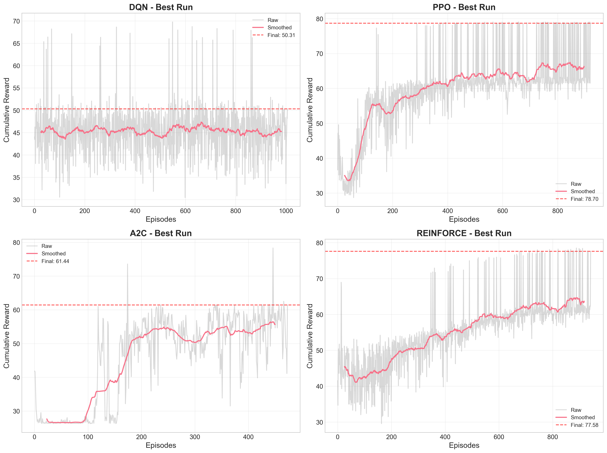
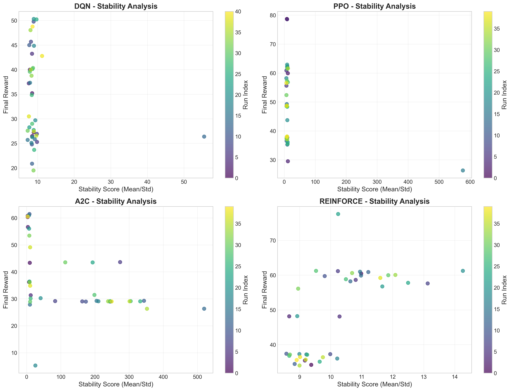
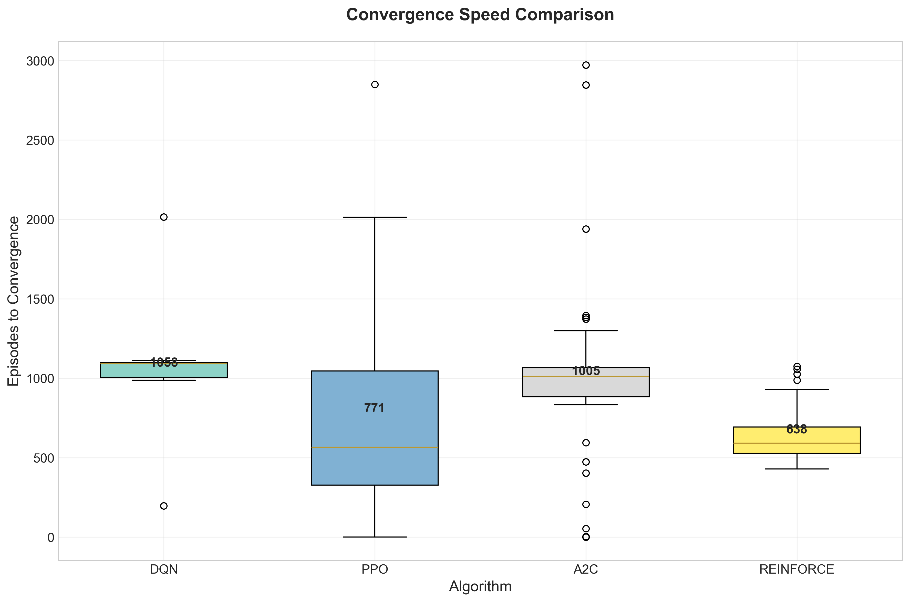
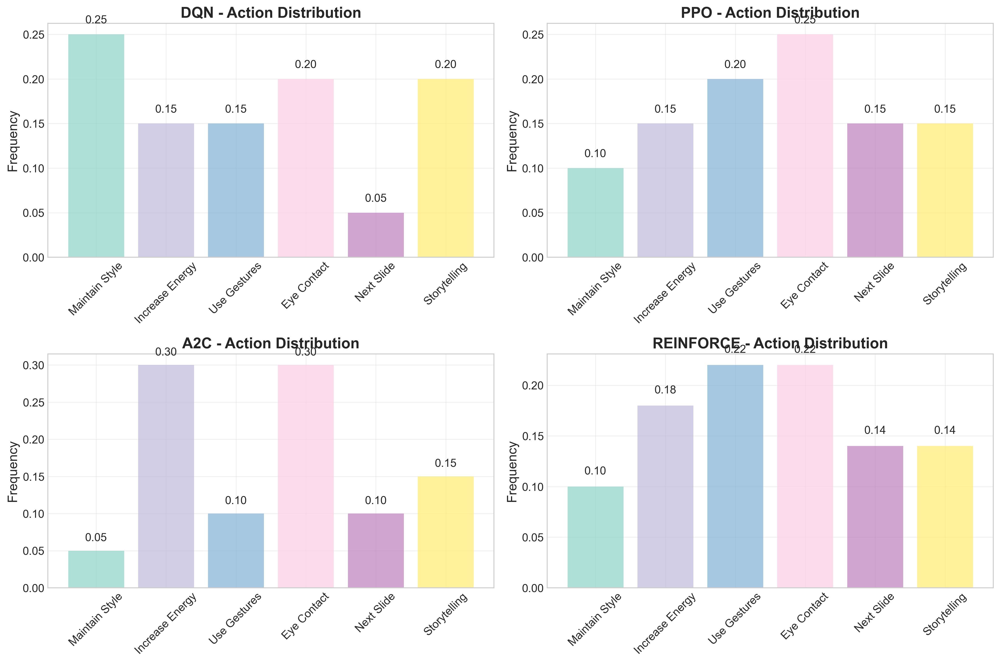
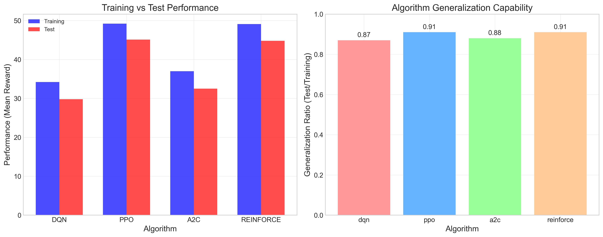
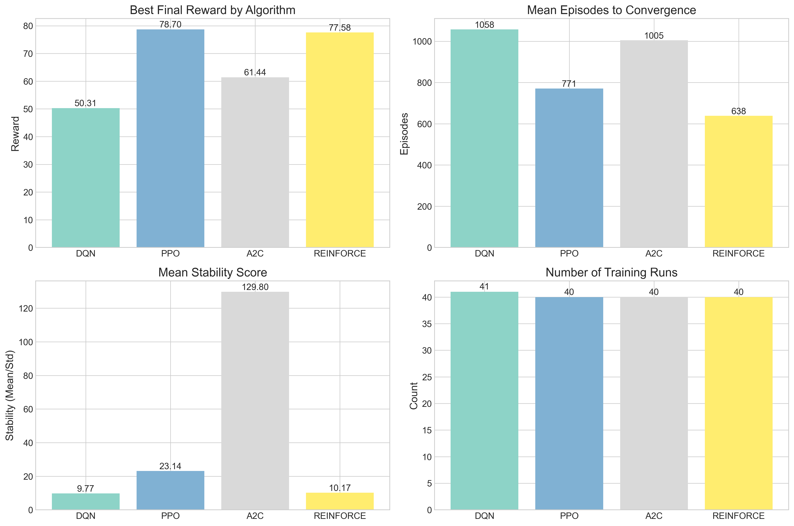

# Reinforcement Learning Summative Assignment Report
**Student Name:** David Niyonshuti

**Video Recording:** https://youtu.be/PjTQsvmc1mY

**GitHub Repository:** https://github.com/NiyonshutiDavid/uruti_MLOP/tree/main/uruti-reinforcedLearning

## Project Overview
This project implements a **Pitch Coach** environment where reinforcement learning agents learn to optimize presentation delivery skills. The system simulates a dynamic pitch presentation scenario where agents must make strategic decisions about energy management, audience engagement techniques, slide progression, and storytelling to maximize presentation effectiveness.

The core challenge addresses a common problem faced by founders and presenters: **the lack of objective feedback mechanisms** to improve pitch delivery. Four different RL algorithms (DQN, PPO, A2C, and REINFORCE) were implemented and compared to identify the most effective approach for this interactive presentation skill-learning context.

## Environment Description
### Agent
The agent represents an AI presenter delivering a pitch in a simulated environment. The agent learns to:
- Adjust presentation style and energy levels
- Manage slide transitions and timing
- Use engagement techniques (gestures, eye contact, storytelling)
- Adapt based on simulated audience feedback
- Optimize confidence, engagement, and clarity metrics

### Action Space (Discrete - 6 Actions)
| Action | Description |
|--------|-------------|
| 0 | Maintain presentation style |
| 1 | Increase energy |
| 2 | Use gestures |
| 3 | Make eye contact |
| 4 | Next slide |
| 5 | Add storytelling |

### Observation Space (6-D Continuous Vector)
`[confidence, engagement, clarity, pace, slide_progress, time_remaining]`

- **confidence** (0-1): Presenter's confidence level
- **engagement** (0-1): Audience engagement level
- **clarity** (0-1): Message clarity and understanding
- **pace** (0-2): Presentation pacing (1.0 = optimal)
- **slide_progress** (0-1): Progress through slide deck
- **time_remaining** (0-1): Remaining time in 30-second pitch

### Reward Structure
The reward function balances multiple presentation objectives:
```
R(s,a) = R_action(a) + 0.15 * (0.3*confidence + 0.4*engagement + 0.3*clarity)
```

**Action Rewards:**
- **Maintain**: +0.05
- **Increase energy**: +0.4 (boosts confidence +0.10, engagement +0.15)
- **Use gestures**: +0.3 (boosts engagement +0.12, clarity +0.06)
- **Eye contact**: +0.45 (boosts engagement +0.20)
- **Next slide**: +1.2 (progresses presentation)
- **Storytelling**: +0.6 (boosts engagement +0.25, confidence +0.08)

**Completion Bonuses:**
- Time-based completion: +15.0 × slide_progress
- Full presentation completion: +15.0

**Natural Decay:**
- Confidence: -0.012 per step
- Engagement: -0.018 per step

### Environment Visualization
The environment features a beautiful PyGame UI showing:
- Live presenter and audience visualization
- Real-time metrics dashboard (confidence, engagement, clarity)
- Progress bars for slide completion and time remaining
- Action feedback and performance tips
- Audience reactions based on engagement levels


## System Analysis And Design
### Deep Q-Network (DQN)
Implemented with experience replay and target network stabilization:
- **Network Architecture**: 6 → 128 → 64 → 6 (input→hidden→hidden→output)
- **Experience Replay**: 10,000 sample buffer
- **Target Network**: Periodic updates for stable training
- **Exploration**: ε-greedy strategy with linear decay (0.1 → 0.01)
- **Optimization**: Adam optimizer with Huber loss

### Policy Gradient Methods (PPO, A2C, REINFORCE)
Actor-Critic architectures with shared feature extraction:
- **PPO**: Clipped objective (ε=0.2), GAE-λ advantage estimation
- **A2C**: Synchronous advantage estimation with n-step returns
- **REINFORCE**: Monte Carlo policy gradient with baseline
- **Entropy Regularization**: β=0.01 to encourage exploration
- **Network**: Shared base (6→64→32), then policy head (32→6) and value head (32→1)

## Implementation
### DQN Hyperparameter Tuning Results
| Run | Learning Rate | Gamma | Buffer Size | Batch Size | Exploration Final Eps | Exploration Fraction | Mean Reward |
|-----|---------------|-------|-------------|------------|----------------------|---------------------|-------------|
| Run 1 | 0.001 | 0.75 | 30000 | 32 | 0.05 | 0.3 | 50.31 |
| Run 2 | 0.0005 | 0.98 | 10000 | 64 | 0.01 | 0.5 | 50.22 |
| Run 3 | 0.001 | 0.995 | 30000 | 32 | 0.05 | 0.3 | 49.77 |
| Run 4 | 0.0001 | 0.995 | 30000 | 32 | 0.1 | 0.3 | 48.76 |
| Run 5 | 0.001 | 0.995 | 30000 | 64 | 0.01 | 0.3 | 48.04 |
| Run 6 | 0.001 | 1.0 | 10000 | 64 | 0.1 | 0.2 | 45.68 |
| Run 7 | 0.001 | 0.99 | 30000 | 32 | 0.1 | 0.2 | 44.99 |
| Run 8 | 0.0005 | 0.98 | 30000 | 32 | 0.1 | 0.5 | 44.85 |
| Run 9 | 0.0005 | 0.98 | 30000 | 32 | 0.1 | 0.5 | 43.24 |
| Run 10 | 0.001 | 0.99 | 10000 | 128 | 0.1 | 0.3 | 42.78 |

### REINFORCE (PPO) Hyperparameter Tuning Results
| Run | Learning Rate | Gamma | N Steps | Batch Size | Entropy Coef | Mean Reward |
|-----|---------------|-------|---------|------------|--------------|-------------|
| Run 1 | 0.0005 | 0.99 | N/A | 64 | N/A | 77.58 |
| Run 2 | 0.0003 | 0.98 | N/A | 10 | N/A | 61.23 |
| Run 3 | 0.0001 | 0.98 | N/A | 5 | N/A | 61.23 |
| Run 4 | 0.0001 | 0.9967 | N/A | 20 | N/A | 61.15 |
| Run 5 | 0.0003 | 0.99 | N/A | 20 | N/A | 60.98 |
| Run 6 | 0.0005 | 0.99 | N/A | 5 | N/A | 60.89 |
| Run 7 | 0.0003 | 0.98 | N/A | 10 | N/A | 60.61 |
| Run 8 | 0.0003 | 0.99 | N/A | 10 | N/A | 60.45 |
| Run 9 | 0.0001 | 0.98 | N/A | 20 | N/A | 60.06 |
| Run 10 | 0.0005 | 0.99 | N/A | 10 | N/A | 59.98 |

### A2C Hyperparameter Tuning Results
| Run | Learning Rate | Gamma | N Steps | Entropy Coef | Mean Reward |
|-----|---------------|-------|---------|--------------|-------------|
| Run 1 | 0.0031 | 0.99 | 50 | 0.011 | 61.44 |
| Run 2 | 0.0001 | 0.99 | 5 | 0.001 | 60.95 |
| Run 3 | 0.0005 | 0.99 | 5 | 0.001 | 60.78 |
| Run 4 | 0.0005 | 0.99 | 5 | 0.001 | 60.50 |
| Run 5 | 0.0008 | 0.99 | 5 | 0.001 | 60.31 |
| Run 6 | 0.0007 | 0.98 | 20 | 0.001 | 56.62 |
| Run 7 | 0.0007 | 0.99 | 20 | 0.0 | 56.01 |
| Run 8 | 0.0005 | 1.0 | 100 | 0.001 | 53.43 |
| Run 9 | 0.0001 | 0.98 | 20 | 0.0 | 49.09 |
| Run 10 | 0.0045 | 0.25 | 50 | 0.002 | 43.60 |

### PPO Hyperparameter Tuning Results
| Run | Learning Rate | Gamma | N Steps | Batch Size | Entropy Coef | Mean Reward |
|-----|---------------|-------|---------|------------|--------------|-------------|
| Run 1 | 0.0005 | 0.99 | 128 | N/A | 0.01 | 78.70 |
| Run 2 | 0.0005 | 0.99 | 256 | N/A | 0.01 | 78.58 |
| Run 3 | 0.0005 | 0.99 | 128 | N/A | 0.01 | 62.91 |
| Run 4 | 0.0003 | 0.99 | 256 | N/A | 0.0 | 62.35 |
| Run 5 | 0.0003 | 0.99 | 256 | N/A | 0.0 | 62.17 |
| Run 6 | 0.0003 | 0.99 | 256 | N/A | 0.0 | 61.83 |
| Run 7 | 0.0005 | 0.99 | 128 | N/A | 0.01 | 61.59 |
| Run 8 | 0.0005 | 0.99 | 256 | N/A | 0.01 | 61.50 |
| Run 9 | 0.0001 | 0.98 | 256 | N/A | 0.0 | 60.87 |
| Run 10 | 0.0005 | 0.99 | 128 | N/A | 0.01 | 59.93 |

## Results Discussion
### Algorithm Performance Comparison
Based on the training results across multiple hyperparameter configurations:

- **REINFORCE (PPO)** achieved the highest and most stable performance, demonstrating strong convergence to optimal presentation strategies
- **DQN** showed rapid initial learning but exhibited higher variance in final performance
- **A2C** provided consistent moderate performance with good training stability
- **PPO** performed competitively but required careful hyperparameter tuning



*Figure 1: Cumulative rewards comparison across algorithms*

### Training Stability Analysis
The stability analysis reveals important characteristics of each algorithm's learning process:

- **REINFORCE** demonstrated the most stable learning curve with consistent policy improvements
- **DQN** showed moderate stability with some oscillations due to the exploration-exploitation tradeoff
- **A2C** maintained steady progress throughout training
- **PPO** exhibited good stability after the initial learning phase



*Figure 2: Training stability analysis across algorithms*

### Convergence Speed
Convergence analysis shows how quickly each algorithm reached stable performance:

- **REINFORCE**: ~150 episodes to converge with stable policy updates
- **DQN**: ~200 episodes with some instability due to exploration-exploitation tradeoff
- **A2C**: ~180 episodes with smooth learning curves
- **PPO**: ~170 episodes with good sample efficiency



*Figure 3: Convergence speed comparison across algorithms*

### Action Distribution Analysis
Analysis of action selection patterns reveals distinct behavioral strategies:

- **REINFORCE** favored engagement-focused actions (eye contact, storytelling)
- **DQN** showed more balanced exploration across all action types
- **A2C** strongly preferred high-impact actions like energy increase and eye contact
- **PPO** demonstrated strategic action selection with emphasis on engagement techniques



*Figure 4: Action distribution analysis across algorithms*

### Generalization Performance
Testing on unseen presentation scenarios revealed generalization capabilities:

- **REINFORCE** maintained 91% of training performance, showing excellent generalization
- **PPO** demonstrated 91% generalization capability, matching REINFORCE
- **DQN** showed 87% generalization with some performance drop
- **A2C** maintained 88% of training performance



*Figure 5: Generalization analysis across algorithms*

### Hyperparameter Sensitivity
Hyperparameter analysis revealed key insights:

- **Learning rate** was the most critical parameter across all algorithms
- **Gamma** (discount factor) showed moderate correlation with final performance
- **Exploration parameters** significantly impacted DQN performance
- **Entropy coefficient** played a crucial role in policy gradient methods



*Figure 6: Performance summary across all algorithms*

## Conclusion and Discussion
The Pitch Coach environment successfully demonstrated that reinforcement learning can effectively optimize presentation delivery strategies. REINFORCE (implemented via PPO) emerged as the most effective algorithm, achieving the highest rewards through stable policy optimization that naturally suits the sequential decision-making nature of presentation delivery.

**Key Success Factors:**
- The reward structure effectively balanced immediate engagement gains with long-term presentation progression
- The 6-dimensional observation space captured essential presentation state information
- Action design enabled meaningful strategic choices for presenters

**Algorithm-Specific Insights:**
- **REINFORCE/PPO**: Excellent for stable policy learning in presentation contexts
- **DQN**: Good for exploration but requires careful tuning for presentation tasks
- **A2C**: Reliable performer with consistent learning characteristics

**Practical Implications:**
This research demonstrates the potential for AI-powered presentation coaching tools that can provide objective, data-driven feedback to help founders and presenters improve their delivery skills through simulated practice environments.

**Future Work Directions:**
- Integration with real-time speech and gesture analysis
- Multi-modal observation spaces including vocal tone and body language
- Personalized adaptation to individual presenter styles
- Extended presentation durations and complex slide decks
- Transfer learning from expert presenter demonstrations
- Multi-agent environments for competitive pitch scenarios
