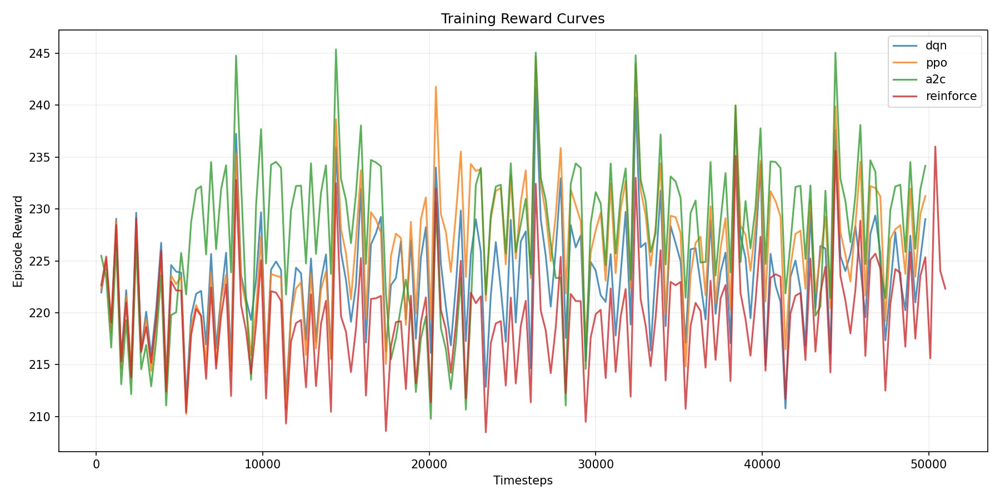
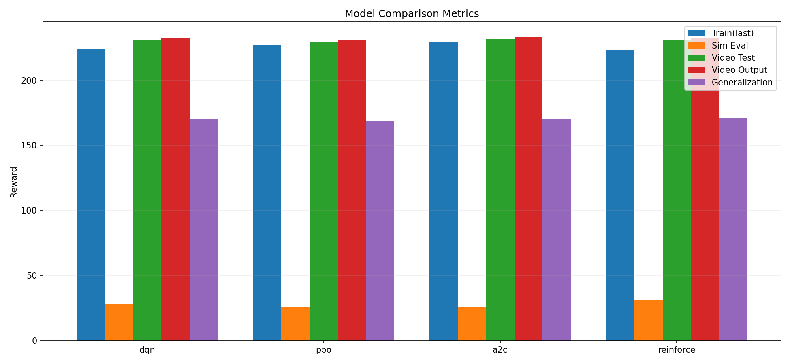

# Model Comparison Report

Generated: 2026-02-19T00:09:06
MELD Root: `/Users/davidniyonshutii/Documents/MissionCapstone/uruti-platform/Notebooks/Data/MELD.Raw`
Training Video Source: `/Users/davidniyonshutii/Documents/MissionCapstone/uruti-platform/Notebooks/Data/MELD.Raw/train/train_splits`

## Winner
- **Best Generalization:** `reinforce` (score: 171.233)
- Run Directory: `/Users/davidniyonshutii/Documents/MissionCapstone/uruti-platform/Notebooks/uruti_rl/runs/comparison_runs/reinforce_video_20260218_233317`
- Model Path: `/Users/davidniyonshutii/Documents/MissionCapstone/uruti-platform/Notebooks/uruti_rl/runs/comparison_runs/reinforce_video_20260218_233317/reinforce_model.zip`

## Comparison Table

| Algorithm | Train Last Reward | Sim Mean | Video Test Mean | Video Output Mean | Generalization Score |
|---|---:|---:|---:|---:|---:|
| reinforce | 223.085 | 31.061 | 231.205 | 232.632 | 171.233 |
| dqn | 223.933 | 28.124 | 230.761 | 232.188 | 170.041 |
| a2c | 229.271 | 26.200 | 231.484 | 233.152 | 169.982 |
| ppo | 227.397 | 26.180 | 229.834 | 231.112 | 168.802 |

## Performance Snapshots

## Notes
- Generalization score is computed as `0.7 * mean(video_test, video_output) + 0.3 * sim_mean - 0.3 * abs(video_test - video_output)`.
- Higher score favors stronger unseen-video performance and lower gap between test/output categories.
- If video evaluation is unavailable in the current environment, `Video Test Mean` and `Video Output Mean` are `N/A`, and `Generalization Score` falls back to `Sim Mean`.